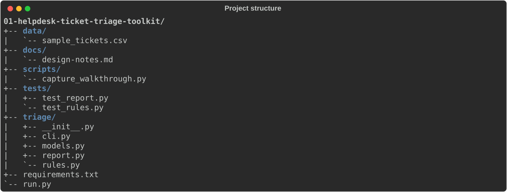
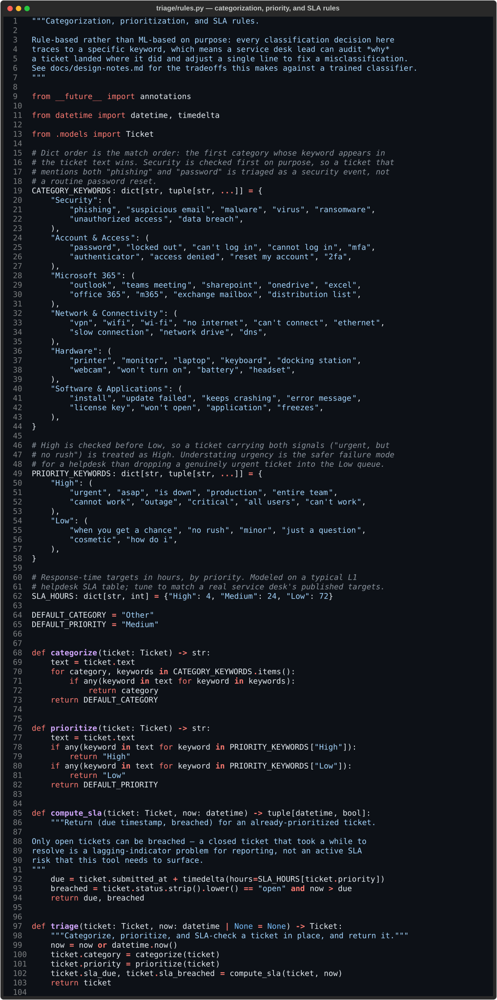
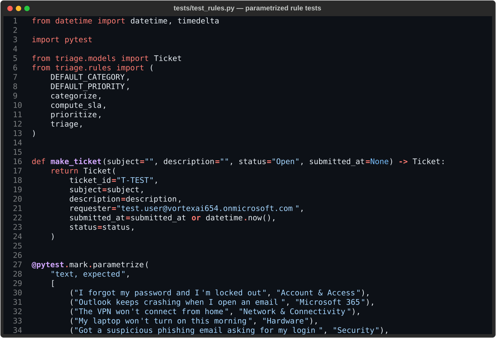
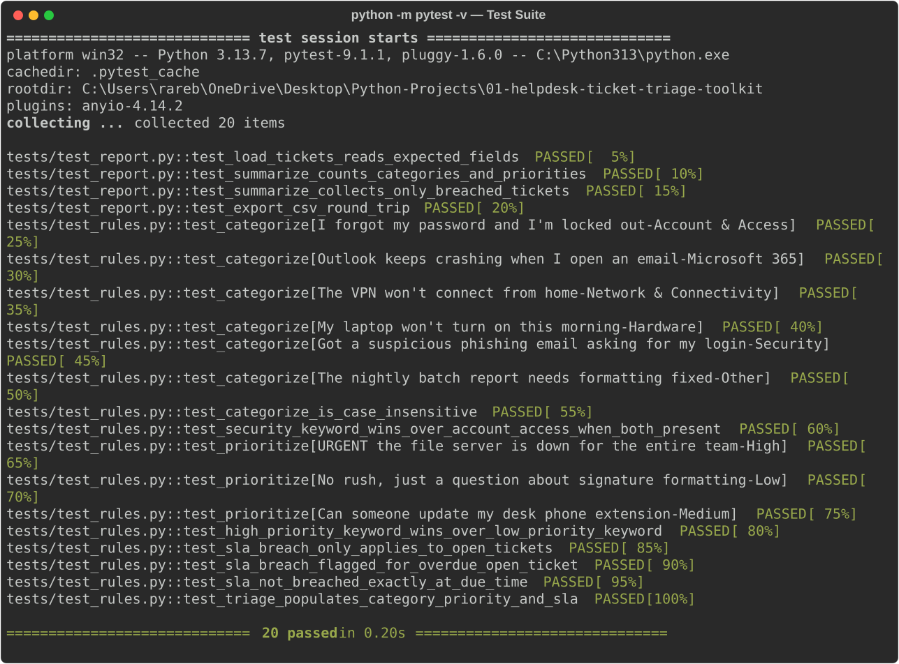
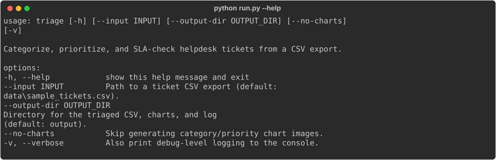
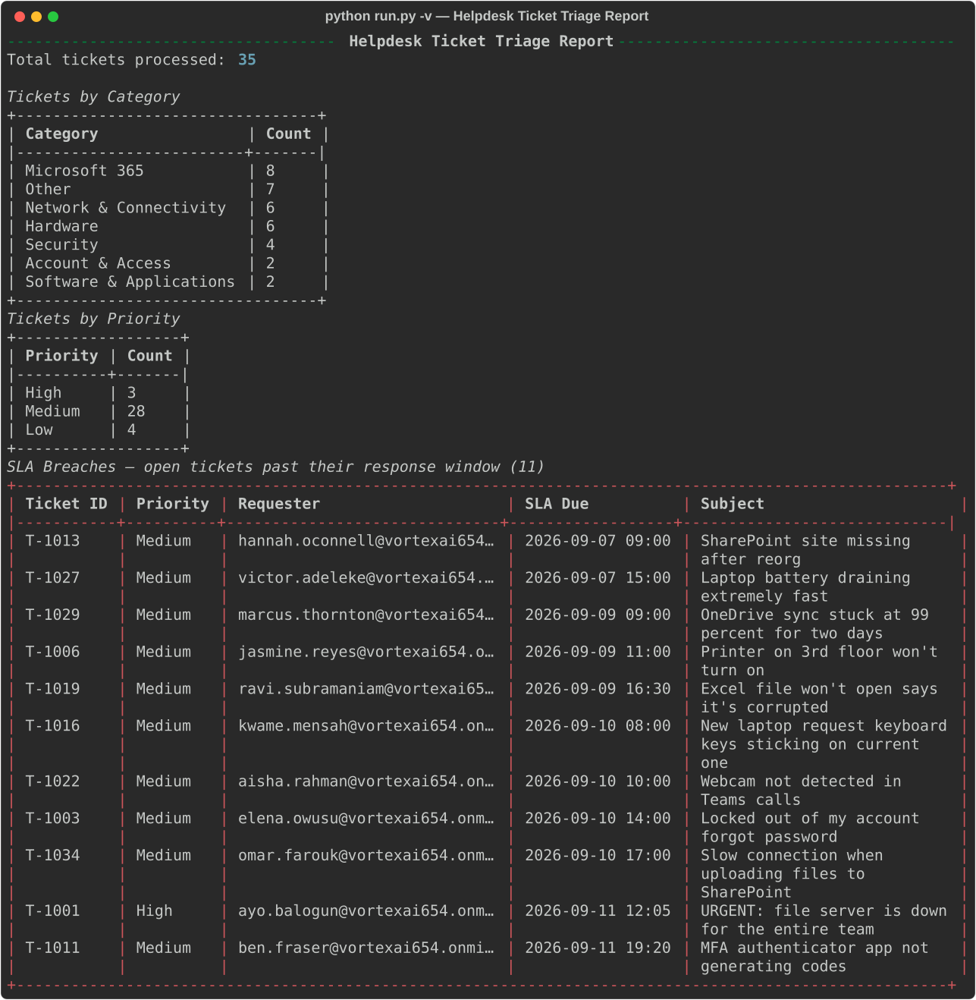
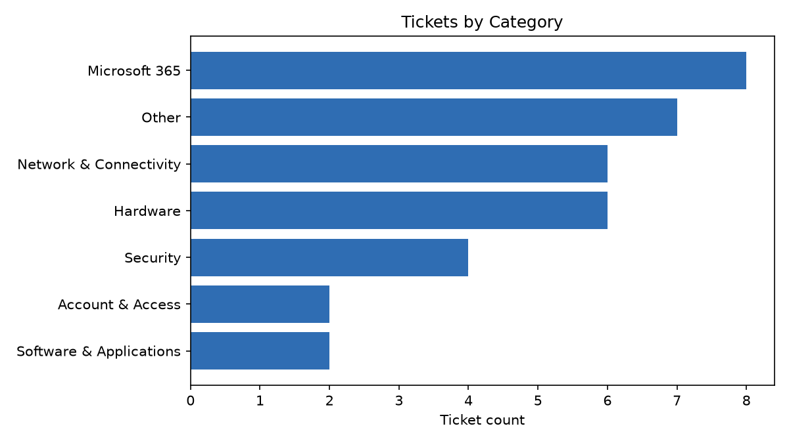
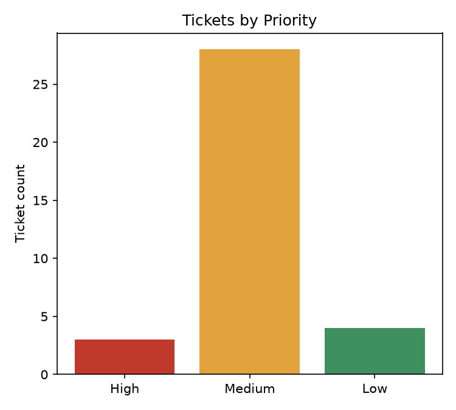
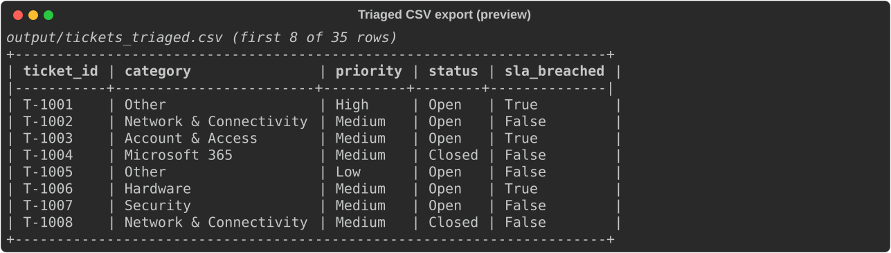

# 01 — Helpdesk Ticket Triage Toolkit

A Python command-line tool that reads a raw helpdesk ticket export, categorizes
and prioritizes every ticket against an explicit, auditable rule set, flags
which open tickets have breached their SLA response window, and produces a
console report, a triaged CSV, and chart images.

**Tooling:** Python 3.13 · [Rich](https://github.com/Textualize/rich) (console
report + terminal capture) · [Matplotlib](https://matplotlib.org/) (charts) ·
[pytest](https://pytest.org/) (test suite)
**Organisation modelled:** `Vortex AI` (fictional) — the same modelled tenant
used across this author's [M365-Lab-Portfolio](https://github.com/malikautomates/microsoft-365-administration-lab),
for a consistent fictional environment across the portfolio.

---

## Why this exists

A ticket queue is only useful once someone has answered three questions for
every item in it: *what kind of problem is this, how urgent is it, and are we
already late.* This tool answers all three automatically from a CSV export —
the same shape of automation a service desk lead would ask a support analyst
to build once the manual version of that triage started eating their morning.

Every image below is a **real capture** of the tool actually running or the
actual source code — not a mockup — regenerated by
[`scripts/capture_walkthrough.py`](scripts/capture_walkthrough.py) before
every commit that touches the code. Every rule's rationale, and the tool's
known limitations, are documented in [docs/design-notes.md](docs/design-notes.md).

---

## Build walkthrough

### Step 1 — Lay out the project and the skeleton

The project separates rules (business logic), report generation, and the CLI
into their own modules, with a bundled fictional dataset so the tool is
runnable and demonstrable out of the box, no live ticket system required.



### Step 2 — Design the categorization, priority, and SLA rules

*Skill: rule-based business logic, Python type hints, dict/tuple data
structures.* Categorization and priority are keyword-driven and intentionally
transparent — every decision traces to one line a non-programmer can read and
edit, and match order is documented inline because it's part of the rule set,
not an implementation detail (see [design-notes.md §1–3](docs/design-notes.md)
for the full rationale, including the tool's known blind spot).



### Step 3 — Write the tests before trusting the rules

*Skill: automated testing with pytest, parametrized test cases, edge-case
thinking.* Each rule above is backed by a test — including the two
precedence rules (Security beats Account & Access, High beats Low) and the
SLA boundary case (exactly-at-due-time is not yet a breach).



Running the full suite — 20 tests, all passing:



### Step 4 — Build a real CLI, not just a script

*Skill: `argparse`, structured logging, packaging for reuse.* The tool takes
`--input`, `--output-dir`, `--no-charts`, and `-v` flags, and writes a log
file on every run — the difference between a one-off script and a tool a
teammate could actually pick up and use.



### Step 5 — Run it against real-shaped data

*Skill: CSV parsing, terminal reporting with Rich, end-to-end verification.*
Run against the bundled 35-ticket sample set, the tool prints a full triage
report to the console, including every open ticket currently past its SLA
window:



### Step 6 — Visualize the results

*Skill: data visualization with Matplotlib.* The same summary that drives the
console report also drives two chart images, written alongside the CSV
export on every run:

| By category | By priority |
|---|---|
|  |  |

### Step 7 — Export the triaged result

*Skill: structured data export, reusable output for downstream tools.* Every
ticket's computed category, priority, and SLA status is written to a CSV a
service desk lead could open directly, or feed into another script:



---

## Usage

```bash
pip install -r requirements.txt

# Run against the bundled sample dataset (35 fictional tickets)
python run.py

# Run against your own export, with debug logging to the console
python run.py --input path/to/export.csv --output-dir output -v

# Skip chart generation
python run.py --no-charts

# Regenerate every screenshot in this README from a live run
python scripts/capture_walkthrough.py
```

## Testing

```bash
python -m pytest -v
```

---

## Repository structure

```
.
├── README.md
├── run.py                       Entry point: python run.py [options]
├── requirements.txt
├── docs/
│   └── design-notes.md          Rationale for the rule design and its known limitations
├── triage/
│   ├── models.py                 Ticket dataclass
│   ├── rules.py                   Categorization, prioritization, and SLA rules
│   ├── report.py                  Load / summarize / export / render / chart
│   └── cli.py                     Argument parsing and orchestration
├── data/
│   └── sample_tickets.csv        35 fictional tickets used for the demo and this README
├── tests/
│   ├── test_rules.py
│   └── test_report.py
├── scripts/
│   └── capture_walkthrough.py    Regenerates every image in this README from a live run
└── screenshots/                  Committed, real captures — see the walkthrough above
```

---

## Limitations and next steps

See [docs/design-notes.md §3](docs/design-notes.md) for the full list. The
short version: keyword matching is deliberately transparent and auditable,
but it can't infer severity from meaning — the sample data includes a
ransomware ticket with no "urgent" in it, which the tool scores Medium, not
High, and that specific miss is documented rather than quietly fixed. A
production version would pair this tool's category/SLA output with mandatory
human review specifically on the `Security` category, rather than trusting
the priority score alone.

Natural next iterations: a confidence score per classification (flag
low-confidence matches for manual review instead of guessing), and a live
connector (Freshdesk/Zendesk/ServiceNow API) in place of a static CSV export.
